[English](README.md) | [中文](README.zh-CN.md) | **日本語**

> **Credits:** オリジナルプロジェクト：[Zara Zhang](https://x.com/zarazhangrui)（[follow-builders](https://github.com/zarazhangrui/follow-builders)）。MITライセンス。

<p align="center">
  
</p>

# AI Builders Brief

**AI業界の最前線を、毎日あなたの手元に。本当にモノを作っている人たちの声を届けます。**

AIエージェント向けスキル。X/Twitter上のトップAIビルダー25名以上、主要ポッドキャスト6番組、
公式ブログの最新情報をキュレーションし、簡潔なデイリー/ウィークリーブリーフとして配信します。
APIキーは一切不要。

> インフルエンサーではなく、独自の見解を持つビルダーをフォローせよ。

## 届くもの

毎日または毎週、お好みのメッセージングアプリ（Telegram、Discord、WhatsAppなど）に配信：

- X/Twitter上の精選AIビルダー25名の重要な投稿とインサイト
- トップAIポッドキャスト6番組の最新エピソード要約
- AI企業公式ブログのハイライト（Anthropic Engineering、Claude Blog）
- すべてのオリジナルコンテンツへの直リンク
- 英語・中国語・日本語・バイリンガル対応

## クイックスタート

### ワンライン・インストール（推奨）
```bash
npx skills add wifecooky/ai-builders-brief
```
Claude Code、Cursor、Codexなど各種エージェントに対応。

### 手動インストール
```bash
# Claude Code
git clone https://github.com/wifecooky/ai-builders-brief.git ~/.claude/skills/ai-builders-brief
cd ~/.claude/skills/ai-builders-brief/scripts && npm install

# OpenClaw
git clone https://github.com/wifecooky/ai-builders-brief.git ~/skills/ai-builders-brief
cd ~/skills/ai-builders-brief/scripts && npm install
```

インストール後、**"set up ai builders brief"** と入力するか `/ai-builders-brief` を実行。
エージェントが対話形式でセットアップを案内します。設定ファイルの手動編集は不要です。

エージェントが確認する内容：
- 配信頻度（毎日または毎週）と時間
- 言語設定（英語、中国語、日本語、バイリンガル）
- 配信方法（Telegram、メール、チャット内表示）

APIキーは不要。すべてのコンテンツは中央サーバーから取得されます。
セットアップ完了後、最初のブリーフがすぐに届きます。

## 設定変更

配信設定は会話で変更できます。エージェントに伝えるだけ：

- 「毎週月曜の朝に変更して」
- 「日本語に切り替えて」
- 「要約をもっと短くして」
- 「現在の設定を表示して」

情報ソース（ビルダーとポッドキャスト）は中央で管理・更新されるため、
何もしなくても常に最新のソースが反映されます。

## 要約スタイルのカスタマイズ

スキルはプレーンテキストのプロンプトファイルでコンテンツの要約方法を制御しています。
2つの方法でカスタマイズ可能：

**会話で変更（推奨）：**
「要約をもっと簡潔にして」「実践的なインサイトに集中して」「カジュアルなトーンにして」
とエージェントに伝えるだけ。プロンプトが自動更新されます。

**直接編集（上級者向け）：**
`prompts/` フォルダ内のファイルを編集：
- `summarize-podcast.md` — ポッドキャストエピソードの要約方法
- `summarize-tweets.md` — X/Twitter投稿の要約方法
- `summarize-blogs.md` — ブログ記事の要約方法
- `digest-intro.md` — ブリーフ全体のフォーマットとトーン
- `translate.md` — 英語コンテンツの翻訳方法

これらはプレーンテキストの指示であり、コードではありません。変更は次回の配信から反映されます。

## デフォルト情報ソース

### ポッドキャスト（6番組）
- [Latent Space](https://www.youtube.com/@LatentSpacePod)
- [Training Data](https://www.youtube.com/playlist?list=PLOhHNjZItNnMm5tdW61JpnyxeYH5NDDx8)
- [No Priors](https://www.youtube.com/@NoPriorsPodcast)
- [Unsupervised Learning](https://www.youtube.com/@RedpointAI)
- [Data Driven NYC](https://www.youtube.com/@DataDrivenNYC)
- [AI & I by Every](https://www.youtube.com/playlist?list=PLuMcoKK9mKgHtW_o9h5sGO2vXrffKHwJL)

### X上のAIビルダー（25名）
[Andrej Karpathy](https://x.com/karpathy), [Swyx](https://x.com/swyx), [Josh Woodward](https://x.com/joshwoodward), [Kevin Weil](https://x.com/kevinweil), [Peter Yang](https://x.com/petergyang), [Nan Yu](https://x.com/thenanyu), [Madhu Guru](https://x.com/realmadhuguru), [Amanda Askell](https://x.com/AmandaAskell), [Cat Wu](https://x.com/_catwu), [Thariq](https://x.com/trq212), [Google Labs](https://x.com/GoogleLabs), [Amjad Masad](https://x.com/amasad), [Guillermo Rauch](https://x.com/rauchg), [Alex Albert](https://x.com/alexalbert__), [Aaron Levie](https://x.com/levie), [Ryo Lu](https://x.com/ryolu_), [Garry Tan](https://x.com/garrytan), [Matt Turck](https://x.com/mattturck), [Zara Zhang](https://x.com/zarazhangrui), [Nikunj Kothari](https://x.com/nikunj), [Peter Steinberger](https://x.com/steipete), [Dan Shipper](https://x.com/danshipper), [Aditya Agarwal](https://x.com/adityaag), [Sam Altman](https://x.com/sama), [Claude](https://x.com/claudeai)

### 公式ブログ（2件）
- [Anthropic Engineering](https://www.anthropic.com/engineering) — Anthropicチームによる技術ディープダイブ
- [Claude Blog](https://claude.com/blog) — Claudeの製品アナウンスとアップデート

## 仕組み

1. 中央フィードが毎日更新され、すべてのソースから最新コンテンツを取得（ブログはウェブスクレイピング、YouTubeはSupadata経由、X/Twitterは公式API）
2. エージェントがフィードを取得 — HTTPリクエスト1回、APIキー不要
3. エージェントがユーザーの設定に基づいて生コンテンツを簡潔なブリーフにリミックス
4. ブリーフが選択したチャンネルに配信（またはチャット内に直接表示）

[examples/sample-digest.md](examples/sample-digest.md) で出力サンプルをご覧ください。

## 必要なもの

- AIエージェント（Claude Code、OpenClaw、Cursorなど）
- インターネット接続（中央フィード取得用）

以上です。APIキーは不要。すべてのコンテンツは中央サーバーで毎日取得・更新されます。

## プライバシー

- APIキーは一切送信されません — すべてのコンテンツは中央サーバーで取得
- Telegram/メール配信を使用する場合、関連キーはローカルの `~/.follow-builders/.env` にのみ保存
- スキルは公開コンテンツのみを読み取り（公開ブログ記事、YouTube動画、X投稿）
- 設定、好み、閲覧履歴はすべてユーザーのマシン上に保持

## ライセンス

MIT
